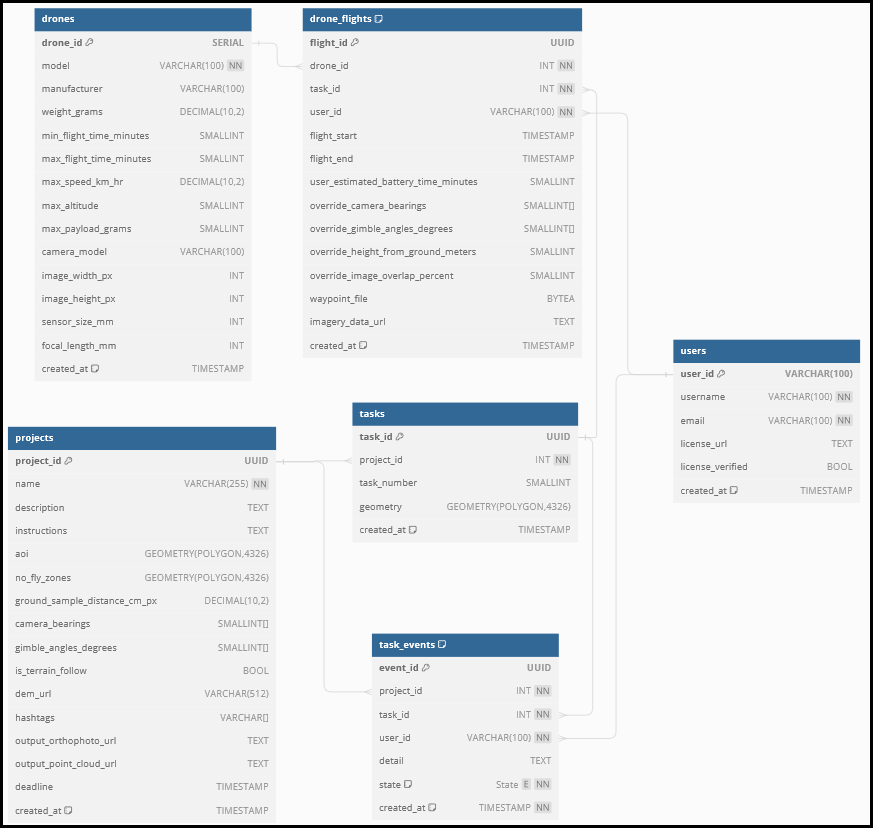

# Database Design

This is not the final version, but a place for ideas where we can iteratively improve
the schema design (key to a long term success).

[Link](https://dbdiagram.io/d/Drone-667a75a79939893dae2e8b43)
to interactive schema viewer.



## Notes on Schema v1 (from messages!)

- We don't need a complicated users table with roles etc yet. Just link users to projects and give them all permissions.
- I put the bare minimum of fields for `projects` / `tasks` to be recorded.
- Different drones and their specs are recorded in the drones table.
- Everything around task status updates is stored in task_actions (instead of duplicating
 info amongst the projects/tasks tables. We will want to partition this table by year for
  good performance long into the future.
- I also made a new table for `drone_flights` that store the waypoint file, plus start and
 finish time of the flight. It also allows an override of variables set by the project 
 manager on `projects`.
- I made `camera_bearings` and `gimbal_angles_degrees` arrays of integers. I think it was
 mentioned we may possibly want multiple directions and angles per waypoint, for example
  a 90° gimbal (no bearing used), 45° gimbal 0° bearing and 45° gimbal 180° bearing for
   N-S imagery.
  - So each specified gimbal angle will be taken for each specified bearing (a 2-d array)
  - If it's necessary to have something irregular like multiple differing gimbal angles in particular directions only, then this approach will not work!
- Note I am also using UUID as the primary key for most tables. Rationale:
  - Allows for the generation of the primary key without a database connection round trip,
   i.e. during project creation, reducing API calls required.
  - The UUID is universally unique, and not just unique to the table - this has a few advantages.
  - Typically an argument against UUIDs is slower INSERT performance. This is pretty minimal these days and not a big concern.
  - It all allows for the use of electric-sql (which does not support types generated on
   the database side, such as SERIAL types). I will cover this topic another day, but 
   let's just say it's a massive improvement over the old approach of having to refresh 
   when tasks are locked/unlocked. We can get realtime update of task statuses / comments.

## Notes on additional schema changes

See `CHANGELOG.md`!

### Allowing project manager to assign operators to tasks

- This can be notification-based:
  - If the user exists in the db:
    - POST an `ASSIGN` event for the task, with required user id.
    - This will lock the task for mapping by the user id, plus notifiy the user
      they should work on the task.
  - If the user does not exist in the db:
    - Do nothing in the task_events.
    - Instead simply notify them that someone requested they work on a specified
      task id, and they should sign up.
    - Give them a sign up link, then they can either:
      - Lock the task themselves to start working on it.
      - The signup link could be specific to also lock the task once they
        successfully sign up.

### User provided drone flight time

- We record the min and max flight times for drones from manufacturer specs.
- Actual flight time is likely less due to battery degredation, flight
  conditions, etc.
- When the user is generating a flight plan, I would suggest we provide an
  optional field for the user to provide their approx drone flight time.
  - We can suggest the recommended ranges from the manufacturer as a guide.
  - If they provide us a value, we factor this into the flight plan.

## ~~Partitioning `task_actions`~~

**EDIT this is probably not a good idea - it overcomplicates the design and we can probably do everything we need with effective indexing & deleting data older than 10yrs**

**See https://gist.github.com/spwoodcock/ad0d6e6869f73f9fccf221b584776575 and  https://github.com/hotosm/fmtm/issues/1610 for more details on a better DB design.**

- Partitions allow the table to be divided by an arbitrary field, in our case a datetime,
  so that we still access the table from the same single identifier, but underneath
  the data is divided into sub-tables per year.
- This significantly improves the data access time, because if you require data from
  2023, the rows are already filtered by the year (so only values from 2023 have to be
  searched).
- For tasking manager the `task_history` table has grown over the years, without
  partitioning in place. This has affected query performance - something we want to avoid.

To prepare our table `task_actions` for partitioning by year:

```sql
CREATE TABLE public.task_actions (
    action_id SERIAL PRIMARY KEY,
    task_id INTEGER NOT NULL,
    user_id VARCHAR(100) NOT NULL,
    comment TEXT,
    action_type TASK_ACTION_TYPE NOT NULL,
    created_at TIMESTAMP WITH TIME ZONE NOT NULL DEFAULT CURRENT_TIMESTAMP,
    CONSTRAINT valid_action_types CHECK (action_type IN ('ready', 'locked', 'complete', 'invalid')),
    FOREIGN KEY (task_id) REFERENCES public.task_areas(task_id),
    FOREIGN KEY (user_id) REFERENCES public.users(user_id)
) PARTITION BY RANGE (EXTRACT(YEAR FROM created_at));

-- Index on the partition key (year) for better performance
CREATE INDEX idx_task_actions_partition_year ON public.task_actions (extract(YEAR FROM created_at));
CREATE INDEX idx_task_id_partitioned ON public.task_actions(task_id);
CREATE INDEX idx_user_id_partitioned ON public.task_actions(user_id);
```

### ~~Manual Partitions~~

Now the table is prepared, we create our separate partitions to access the data from:

```sql
CREATE TABLE public.task_actions_2023 PARTITION OF public.task_actions
    FOR VALUES FROM ('2023-01-01') TO ('2024-01-01');

CREATE TABLE public.task_actions_2024 PARTITION OF public.task_actions
    FOR VALUES FROM ('2024-01-01') TO ('2025-01-01');
```

Then we access `public.task_actions` as normal, but underneath the partitioned tables
are accessed.

It is also possible to generate these dynamically via a function like:

```sql
DO $$
DECLARE
    start_year INTEGER := EXTRACT(YEAR FROM CURRENT_DATE)::INTEGER;
    end_year INTEGER := start_year + 5; -- Create partitions for the next 5 years
    current_year INTEGER;
BEGIN
    FOR current_year IN start_year .. end_year LOOP
        EXECUTE format('
            CREATE TABLE IF NOT EXISTS public.task_actions_%1$s (
                CONSTRAINT pk_task_actions_%1$s PRIMARY KEY (action_id),
                CHECK (action_time >= DATE ''%1$s-01-01'' AND action_time < DATE ''%1$s-01-01'' + INTERVAL ''1 year'')
            ) INHERITS (public.task_actions);',
            current_year
        );
    END LOOP;
END $$;
```

### ~~Automated Partitions~~

- The process above can be cumbersome and difficult to maintain.
- Instead we can use some extensions to automate this.

Two very useful resources:
[Info on partitions](https://medium.com/@joao-slgd/partitioning-your-postgresql-table-d56c678d3276)
[Info on pg_partman & pg_cron in docker](https://eduanbekker.com/post/pg-partman/)

```sql
CREATE SCHEMA IF NOT EXISTS partman;
CREATE SCHEMA IF NOT EXISTS retention;

CREATE EXTENSION IF NOT EXISTS pg_partman WITH SCHEMA partman;
CREATE EXTENSION IF NOT EXISTS pg_cron;

-- Option 1: ongoing partitions
select partman.create_parent(
  'public.task_actions',
  'created_at',
  'native',
  'yearly',
  p_start_partition := '2024-01-01' -- Optional
);

-- Table name: public.task_actions
-- Partition key: created_at
-- Partition strategy: native
-- Partition range: yearly
-- Partition Start Date: 2024–01–01

-- Option 2: this updates the set config above
-- partitions with retention (i.e. deletion after a certain date)
update partman.part_config
set infinite_time_partitions = true,
    retention = '24 months', -- 2 years, NULL = Infinite
    retention_keep_table=true,
    retention_schema='retention'
where parent_table = 'public.task_actions';

-- Infinite number of partitions: true
-- Retention in public schema: 24 months
-- Keep table after retention period in public schema: true
-- Retention schema after retention period: retention

-- Finally: we set a cron to have pg_partman run regularly

-- E.g. hourly, all maintenance jobs
SELECT cron.schedule('@hourly', $$CALL partman.run_maintenance_proc()$$);

-- E.g. At midnight on 1st Jan every year, on specific table only
SELECT cron.schedule(
  '0 0 1 1 *',
  'SELECT partman.run_maintenance_proc(
    ''public.task_actions'',
    ''time'')'
  );
```

> Note to run this manually for testing, use: `CALL partman.run_maintenance_proc();`
>
> As linked above, installing pg_partman & pg_cron in Docker may take a few extra steps.
> ([Link](https://eduanbekker.com/post/pg-partman/))
