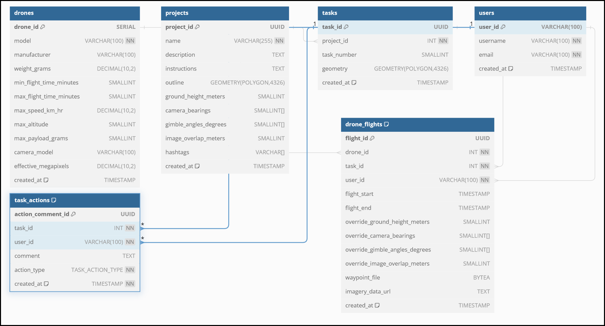

# Database Design

This is not the final version, but a place for ideas where we can iteratively improve
the schema design (key to a long term success).

[Link](https://dbdiagram.io/d/Drone-667a75a79939893dae2e8b43)
to interactive schema viewer.

## Notes on Schema v1 (from messages!)

- We don't need a complicated users table with roles etc yet. Just link users to projects and give them all permissions.
- I put the bare minimum of fields for `projects` / `tasks` to be recorded.
- Different drones and their specs are recorded in the drones table.
- Everything around task status updates is stored in task_actions (instead of duplicating
 info amongst the projects/tasks tables. We will want to partition this table by year for
  good performance long into the future.
- I also made a new table for `drone_flights` that store the waypoint file, plus start and
 finish time of the flight. It also allows an override of variables set by the project 
 manager on `projects`.
- I made `camera_bearings` and `gimbal_angles_degrees` arrays of integers. I think it was
 mentioned we may possibly want multiple directions and angles per waypoint, for example
  a 90° gimbal (no bearing used), 45° gimbal 0° bearing and 45° gimbal 180° bearing for
   N-S imagery.
  - So each specified gimbal angle will be taken for each specified bearing (a 2-d array)
  - If it's necessary to have something irregular like multiple differing gimbal angles in particular directions only, then this approach will not work!
- Note I am also using UUID as the primary key for most tables. Rationale:
  - Allows for the generation of the primary key without a database connection round trip,
   i.e. during project creation, reducing API calls required.
  - The UUID is universally unique, and not just unique to the table - this has a few advantages.
  - Typically an argument against UUIDs is slower INSERT performance. This is pretty minimal these days and not a big concern.
  - It all allows for the use of electric-sql (which does not support types generated on
   the database side, such as SERIAL types). I will cover this topic another day, but 
   let's just say it's a massive improvement over the old approach of having to refresh 
   when tasks are locked/unlocked. We can get realtime update of task statuses / comments.
