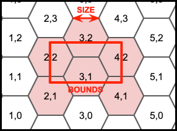

# Drone TM Task Splitter

- A hexagon grid is used to maximise captured imagery per flight,
  while ensuring visual line of sight of the drone.
- PostGIS has a ST_HexagonGrid function built in to aid this.
- The `generate_hexagon_grid.sql` file contains a first attempt at a splitting function.
  - This takes three params: the AOI, a hexagon size, and a buffer.
  - The hexagon size determines the length of each side:
    
  - The buffer determines how much of a buffer should be used to ensure full 
    coverage of the AOI (default 50m).
  - An offset of 75m in each direction is used to determine the shift with the
    minimum number of hexagons (as sometimes they get cut off at the edges).
  - The EPSG 4326 is projected to web mercator to use metres for all inputs.
    This could probably be improved.

## Usage

- Execute the `generate_hexagon_grid.sql` code in your database, to create function
  `generate_hexagon_grid`.
- Pass in the params to generate a grid.
- Either from an existing table:
  `SELECT generate_hexagon_grid((SELECT outline FROM projects LIMIT 1), 100, 50);`
- Or from a text based geojson:
    ```sql
    WITH aoi_geom AS (
        SELECT ST_SetSRID(ST_GeomFromGeoJSON('
            {
                "type": "Polygon",
                "coordinates": [
                    [
                        [85.29998911024427, 27.714008043780694],
                        [85.29998911024427, 27.710892349952076],
                        [85.30478315714117, 27.710892349952076],
                        [85.30478315714117, 27.714008043780694],
                        [85.29998911024427, 27.714008043780694]
                    ]
                ]
            }
        '), 4326) AS geom
    )

    SELECT generate_best_hexagon_grid(geom, 100, 50) AS hexgrid
    FROM aoi_geom;
    ```

> In the long run we will encapsulate the logic in a Python script.
>
> The function should be `CREATE OR REPLACE` on the database, then
> the function called from the Python db driver.
